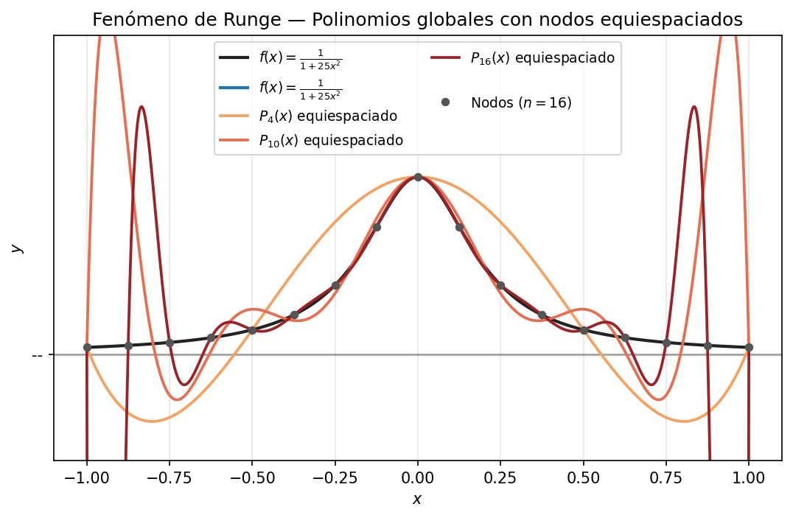
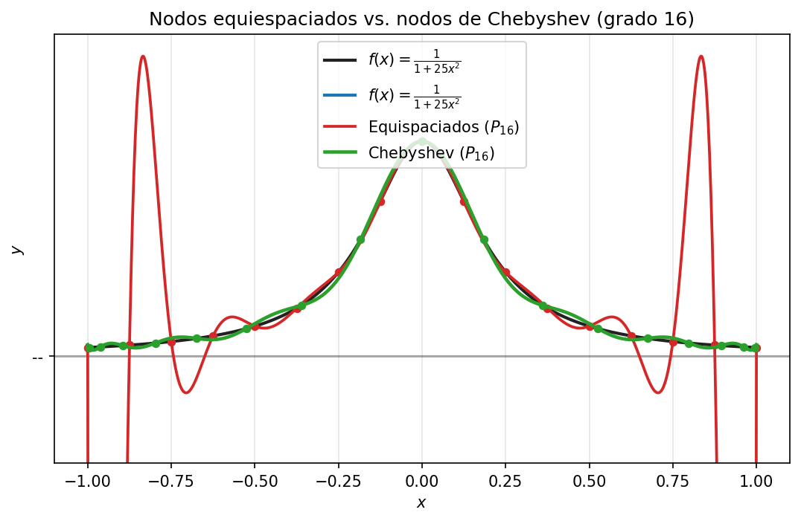
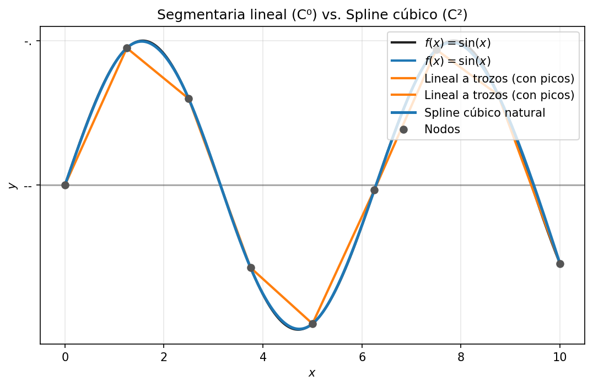
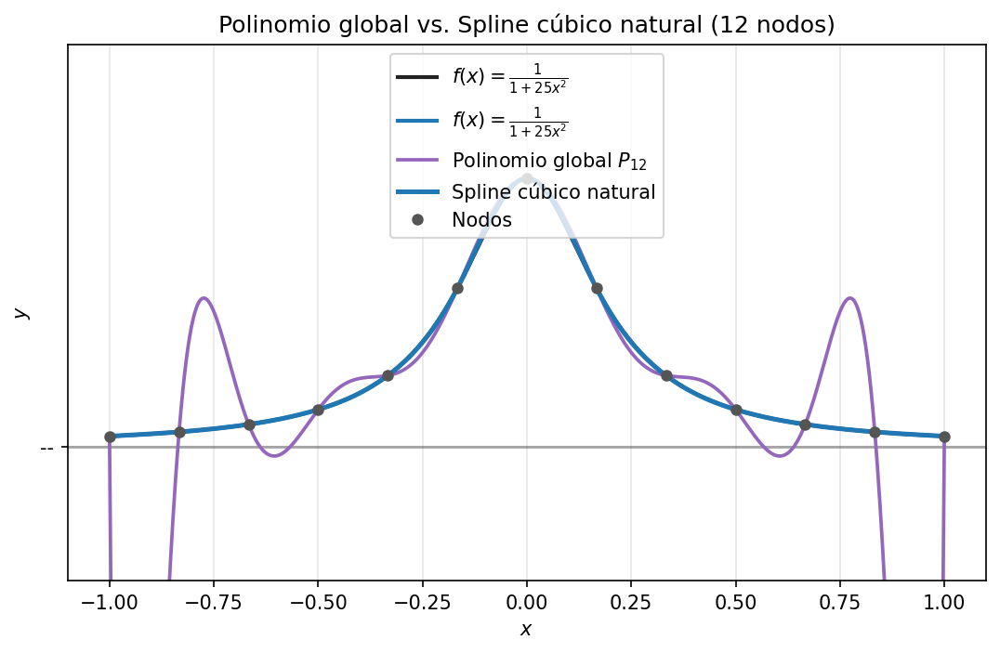
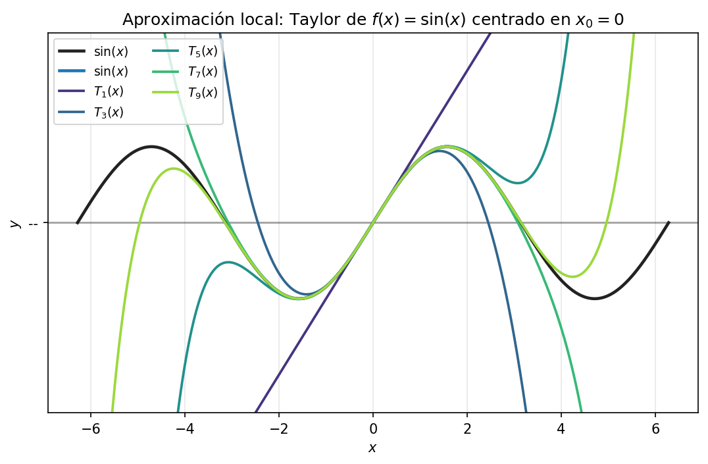

# Interpolación Polinómica 📐

La interpolación polinómica es una herramienta fundamental en el análisis numérico, ya que permite aproximar funciones complejas o datos discretos mediante una expresión algebraica manejable: el polinomio.

> **Nota sobre las figuras:** El cálculo numérico requiere intuición geométrica. Las imágenes de este documento son gráficas estáticas generadas con Matplotlib a partir de las implementaciones en Python; pueden regenerarse ejecutando [`codigo/generar_graficas.py`](./codigo/generar_graficas.py). Ver visualmente la campana de Runge oscilando frente a la curva suave de los Splines vale más que mil ecuaciones.

> **Definición:**: Es una técnica que consiste en encontrar un polinomio que pase exactamente por un conjunto de puntos dados. Dado un conjunto de $n+1$ puntos, existe un único polinomio de grado *a lo sumo* $n$ que satisface todas las condiciones de interpolación, resultado garantizado por el determinante de Vandermonde.

## El Polinomio de Interpolación: Concepto General

Dado un conjunto de $n+1$ puntos discretos $(x_0, y_0), \dots, (x_n, y_n)$, el polinomio de interpolación $P(x)$ es una función algebraica de grado $n$ que satisface la **condición de interpolación**:

$$P(x_i) = y_i \quad \text{para todo } i = 0, 1, \dots, n$$

**Características clave:**

- **Ajuste exacto:** A diferencia de la regresión por mínimos cuadrados, la curva pasa físicamente por todos los puntos dados, sin margen de error en los nodos.
- **Límite de grado:** $n+1$ puntos garantizan un polinomio de grado *a lo sumo* $n$ (2 puntos $\to$ recta, 3 $\to$ parábola, etc.). Ojo con el matiz: el teorema fija un **tope**, no una igualdad. Si los datos tienen estructura simple, el grado real baja sin pedirlo nadie — tres puntos colineales producen una recta (grado 1), no una parábola, porque al resolver el sistema el coeficiente de $x^2$ resulta ser exactamente 0. El grado $n$ solo aparece cuando los puntos realmente lo exigen.
- **Independencia del método:** Lagrange, Newton y Vandermonde no generan polinomios diferentes, sino caminos algorítmicos distintos para calcular el mismo y único polinomio $P(x)$.

## Teorema de Existencia y Unicidad de la Interpolación Polinómica

El teorema de existencia y unicidad es el pilar fundamental sobre el que se construye toda la teoría de la interpolación polinómica clásica. Garantiza que, sin importar el método algebraico que se utilice —Lagrange o Newton—, el polinomio resultante será exactamente el mismo, aunque esté expresado de forma diferente.

### Enunciado

Dados $n+1$ puntos distintos $(x_0, y_0), (x_1, y_1), \dots, (x_n, y_n)$, con $x_i \neq x_j$ para todo $i \neq j$, **existe un único polinomio** $P(x)$ de grado menor o igual a $n$ tal que:

$$P(x_i) = y_i \quad \text{para todo } i = 0, 1, \dots, n$$

### Demostraciones

El teorema puede demostrarse por dos vías principales. La demostración completa de ambas se encuentra en el archivo de [Demostración del Teorema de Unicidad](./demostraciones/unicidad.md).

**1. Por el Teorema Fundamental del Álgebra (reducción al absurdo):** Suponiendo dos polinomios $P(x)$ y $Q(x)$ que interpolan los mismos puntos, su diferencia $D(x) = P(x) - Q(x)$ se anula en $n+1$ nodos. Un polinomio de grado $\le n$ con $n+1$ raíces debe ser el polinomio nulo, por lo que $P = Q$.

**2. Por Álgebra Lineal (Matriz de Vandermonde):** El sistema $Va = y$ tiene matriz de Vandermonde con determinante $\det(V) = \prod_{i < j} (x_j - x_i) \neq 0$, lo que garantiza solución única para los coeficientes.

### Implicación práctica

Una consecuencia directa es que **no existen diferencias de precisión teórica entre el Polinomio de Lagrange y el de Newton** si se aplican sobre los mismos datos. Ambos son algoritmos numéricos diferentes para encontrar el mismo y único polinomio. La elección entre uno u otro recae en la eficiencia computacional: Newton permite agregar nuevos puntos sin recalcular todo, mientras que Lagrange no.

## La Matriz de Vandermonde

El enfoque más directo para encontrar el polinomio interpolador consiste en plantear su forma canónica $P(x) = a_0 + a_1x + \dots + a_nx^n$ e imponer la condición $P(x_i) = y_i$ para cada nodo, generando un sistema $V \cdot a = y$:

$$
V = \begin{pmatrix}
1 & x_0 & x_0^2 & \dots & x_0^n \\
1 & x_1 & x_1^2 & \dots & x_1^n \\
\vdots & \vdots & \vdots & \ddots & \vdots \\
1 & x_n & x_n^2 & \dots & x_n^n
\end{pmatrix},\qquad
\det(V) = \prod_{0 \le i < j \le n} (x_j - x_i) \neq 0
$$

Teóricamente el sistema tiene solución única ($\det(V) \neq 0$), pero numéricamente la matriz de Vandermonde está **mal condicionada**: las potencias altas generan columnas de magnitudes muy dispares, amplificando errores de redondeo. Por eso **en la práctica nunca se usa**; en su lugar se emplean algoritmos estables como Lagrange o Newton, que encuentran el mismo polinomio sin resolver sistemas peligrosos.

## Principales métodos de interpolación polinómica

1. **Lagrange**: [Ejemplo 1](./ejemplos/ejemplo-1.md) | [Código Python](./codigo/langrage-polinomio.py)
2. **Newton**: [Ejemplo 2](./ejemplos/ejemplo-2.md) | [Código Python](./codigo/newton-polinomio.py)
3. **Hermite**: [Ejemplo 3](./ejemplos/ejemplo-3.md) | [Código Python](./codigo/hermite-polinomio.py)
4. **Spline**: [Ejemplo 4](./ejemplos/ejemplo-4.md) | [Código Python](./codigo/spline-polinomio.py)
5. **Chebyshev**: [Ejemplo 5](./ejemplos/ejemplo-5.md) | [Código Python](./codigo/chebyshev-polinomio.py)
6. **Taylor**: [Ejemplo 7](./ejemplos/ejemplo-7.md) | [Código Python](./codigo/taylor-polinomio.py)

## Método de Interpolación de Lagrange

Este método, en lugar de resolver un sistema de ecuaciones complicado, propone armar el polinomio como una "combinación" de piezas más simples llamadas polinomios base ($L_i$).

> **Formulación:** Dado un conjunto de puntos $(x_0, y_0), (x_1, y_1), ..., (x_n, y_n)$, el polinomio de interpolación de Lagrange se define como:

$$P(x) = \sum_{i=0}^{n} y_i L_i(x)$$

donde los polinomios de base $L_i(x)$ se calculan como:

$$L_i(x) = \prod_{\substack{j=0 \\ j \neq i}}^{n} \frac{x - x_j}{x_i - x_j}$$

Cada $L_i(x)$ es un polinomio de grado $n$ con las siguientes propiedades:
- Cada bloque $L_i$ vale 1 cuando evaluamos en su propio punto $x_i$.
- Ese mismo bloque vale 0 en todos los demás puntos de la lista.

En resumen, cada polinomio de base $L_i(x)$ es igual a 1 en $x_i$ y 0 en los demás puntos para $i \neq j$, lo que garantiza que el polinomio de interpolación pase por todos los puntos dados.

La formulación anterior se traduce en código casi literal: el bucle interno construye cada $L_i(x)$ como producto, y el externo acumula la suma ponderada $\sum y_i L_i(x)$:

```python
def obtener_polinomio_lagrange(x_points, y_points):
    x = sp.Symbol('x')
    n = len(x_points)
    polinomio = 0

    # Bucle externo: recorre cada punto i para construir su base L_i(x)
    for i in range(n):
        L_i = 1

        # Bucle interno: producto (x - x_j) / (x_i - x_j) para todo j != i
        for j in range(n):
            if j != i:
                L_i *= (x - x_points[j]) / (x_points[i] - x_points[j])

        polinomio += y_points[i] * L_i     # suma y_i * L_i(x)

    return sp.simplify(polinomio), x
```

**Ejemplo práctico**: Consulta el [Ejemplo 1](./ejemplos/ejemplo-1.md) para ver una aplicación paso a paso del método de Lagrange.

**Implementación**: Revisa el [código en Python](./codigo/langrage-polinomio.py) que implementa el algoritmo de interpolación de Lagrange.

## Método de Interpolación de Newton

El método de Diferencias Divididas de Newton es una forma algorítmica y eficiente de obtener el mismo polinomio único que Lagrange, pero construido de manera incremental.

> **Formulación:** Expresa el polinomio interpolador en una base diferente, asociadas a los nodos de interpolación:

$$P(x) = f[x_0] + f[x_0, x_1](x - x_0) + f[x_0, x_1, x_2](x - x_0)(x - x_1) + ... + f[x_0, x_1, ..., x_n](x - x_0)(x - x_1)...(x - x_{n-1})$$

Los coeficientes $f[x_0, x_1, ..., x_k]$ se denominan diferencias divididas y se calculan de manera recursiva a partir de los valores de la función en los puntos dados:

$$f[x_0, ..., x_n] = \frac{f[x_1, ..., x_n] - f[x_0, ..., x_{n-1}]}{x_n - x_0}$$

con la condición inicial $f[x_k] = f(x_k)$.

Este método es especialmente útil cuando se agregan nuevos puntos de interpolación, ya que permite actualizar el polinomio sin necesidad de recalcular todo desde cero. En términos computacionales: construir la tabla completa cuesta $O(n^2)$ operaciones, pero incorporar un punto nuevo solo requiere $O(n)$.

### Tabla de Diferencias Divididas

> La tabla de diferencias divididas es una estructura triangular donde cada columna representa un nivel de "tasa de cambio" entre los puntos. Es el motor que alimenta al método de Newton.

#### 1. La Disposición de los Datos

Primero, colocas tus puntos $(x_i, f[x_i])$ en las dos primeras columnas. El resto de las columnas se irán llenando hacia la derecha.

| i | $x_i$ | $f[x_i]$ (Nivel 0) | Primera (Nivel 1) | Segunda (Nivel 2) |
|---|-------|-------------------|-------------------|-------------------|
| 0 | $x_0$ | $y_0$ | | |
| 1 | $x_1$ | $y_1$ | $f[x_0, x_1]$ | |
| 2 | $x_2$ | $y_2$ | $f[x_1, x_2]$ | $f[x_0, x_1, x_2]$ |

#### 2. Cálculo del Nivel 1 (Pendientes Simples)

Para obtener el valor entre dos puntos, restas sus $y$ y lo divides por la resta de sus $x$. Es exactamente la fórmula de la pendiente de una recta:

$$f[x_i, x_{i+1}] = \frac{f[x_{i+1}] - f[x_i]}{x_{i+1} - x_i}$$

#### 3. Cálculo de Niveles Superiores (La Regla General)

A medida que avanzas a la derecha, usas los resultados de la columna anterior. Lo más importante aquí es la resta en el denominador: siempre usas las $x$ de los extremos que abarca esa diferencia.

La fórmula general es:

$$f[x_i, ..., x_{i+k}] = \frac{f[x_{i+1}, ..., x_{i+k}] - f[x_i, ..., x_{i+k-1}]}{x_{i+k} - x_i}$$

La fórmula general es exactamente el doble bucle que llena la tabla: la columna $j$ se calcula combinando dos celdas vecinas de la columna $j-1$, donde `tabla[i][j]` almacena $f[x_i, x_{i+1}, \dots, x_{i+j}]$:

```python
def tabla_diferencias_divididas(x_points, y_points):
    n = len(x_points)
    tabla = [[0.0 for _ in range(n)] for _ in range(n)]

    for i in range(n):
        tabla[i][0] = y_points[i]          # nivel 0: f[x_i] = f(x_i)

    # Cada celda combina dos vecinas de la columna anterior
    for j in range(1, n):                  # orden j de la diferencia
        for i in range(n - j):             # fila i de la tabla
            tabla[i][j] = (
                (tabla[i + 1][j - 1] - tabla[i][j - 1])
                / (x_points[i + j] - x_points[i])
            )

    return tabla
```

**Ejemplo práctico**: Consulta el [Ejemplo 2](./ejemplos/ejemplo-2.md) para ver una aplicación paso a paso del método de Newton.

**Implementación**: Revisa el [código en Python](./codigo/newton-polinomio.py) que implementa el algoritmo de interpolación de Newton.

## Interpolación de Hermite

> **Definición:** La interpolación de Hermite es un método de aproximación polinómica que generaliza la interpolación clásica al incorporar información no solo de los valores de la función, sino también de sus derivadas en los nodos de interpolación.

Dados $n+1$ puntos distintos $x_0, x_1, \ldots, x_n$, se conocen los valores de la función $f(x_i)$ y de su derivada $f'(x_i)$ en cada nodo. El objetivo es encontrar un polinomio $H(x)$ de grado mínimo que satisfaga:

$$H(x_i) = f(x_i), \quad H'(x_i) = f'(x_i), \quad i = 0, 1, \ldots, n$$

Este polinomio existe, es único, y tiene grado $2n+1$, ya que se dispone de $2n+2$ datos para construirlo ($n+1$ valores de la función y $n+1$ valores de la derivada).

### Nodos repetidos

Para construir el polinomio de Hermite usando el método de Newton con diferencias divididas, se define un conjunto de puntos $z_0, z_1, \ldots, z_{2n+1}$ donde cada nodo $x_i$ aparece repetido dos veces:

$$z_{2i} = z_{2i+1} = x_i, \quad i = 0, 1, \ldots, n$$

### Fórmula de diferencias divididas con nodos repetidos

La tabla de diferencias divididas se construye siguiendo estas reglas:

Para nodos ordenados $x_0 \leq x_1 \leq \cdots \leq x_k$:

$$f[x_0, x_1, \ldots, x_k] = \frac{f^{(k)}(x_0)}{k!} \text{ si } x_0 = x_k$$

$$f[x_0, x_1, \ldots, x_k] = \frac{f[x_1, \ldots, x_k] - f[x_0, \ldots, x_{k-1}]}{x_k - x_0} \text{ si } x_0 \neq x_k$$

**Reglas clave:**
- Cuando los nodos son idénticos: $f[x_i, x_i] = f'(x_i)$
- Para tres nodos repetidos: $f[x_i, x_i, x_i] = \frac{f''(x_i)}{2!}$
- En general: $f[x_i, x_i, \ldots, x_i] = \frac{f^{(j)}(x_i)}{j!}$ donde $j$ es el número de repeticiones menos 1

En código, la tabla de Hermite es el mismo doble bucle de Newton con una sola adición: cuando los extremos coinciden ($x_k = x_0$), la celda toma la derivada en lugar de dividir entre cero:

```python
def diferencias_divididas_hermite(x_vals, y_vals, dy_vals):
    """
    Tabla sobre los nodos repetidos z_2i = z_2i+1 = x_i.
    dy_vals[i] = f'(x_i) resuelve las columnas con nodos idénticos.
    """
    n = len(x_vals)
    tabla = [[0 for _ in range(n)] for _ in range(n)]

    for i in range(n):
        tabla[i][0] = y_vals[i]

    for j in range(1, n):
        for i in range(n - j):
            if x_vals[i + j] == x_vals[i]:
                tabla[i][j] = dy_vals[i]   # f[..., x_i, x_i] = f'(x_i)
            else:
                tabla[i][j] = (
                    (tabla[i + 1][j - 1] - tabla[i][j - 1])
                    / (x_vals[i + j] - x_vals[i])
                )

    return tabla
```

### Tabla de diferencias divididas para Hermite

La tabla se construye repitiendo cada nodo y colocando las derivadas según corresponda. Para el caso de dos nodos $(x_0, x_1)$ con sus respectivas derivadas $(d_0, d_1)$:

| $x_i$ | D.D. Orden 0 | D.D. Orden 1 | D.D. Orden 2 | D.D. Orden 3 |
|-------|---------------|---------------|---------------|---------------|
| $x_0$ | $y_0$ | | | |
| $x_0$ | $y_0$ | $d_0$ | | |
| $x_1$ | $y_1$ | $P_1$ | $(P_1 - d_0)/h$ | |
| $x_1$ | $y_1$ | $d_1$ | $(d_1 - P_1)/h$ | $(d_0 + d_1 - 2P_1)/h^2$ |

Donde $h = x_1 - x_0$ es la distancia entre nodos.

> **⚠ $P_1$ es un paso intermedio, no un dato:** antes de poder llenar las columnas de orden 2 y 3 hay que calcular manualmente dos cantidades auxiliares. Primero la distancia entre nodos, $h = x_1 - x_0$, y luego la pendiente simple entre ellos:
>
> $$P_1 = f[x_0, x_1] = \frac{y_1 - y_0}{x_1 - x_0} = \frac{y_1 - y_0}{h}$$
>
> Solo con esos dos valores a mano se pueden completar las celdas superiores de la tabla. Todas usan el **mismo denominador** $h$ (o su cuadrado), porque la regla general de diferencias divididas siempre divide por la resta de los nodos extremos que abarca cada celda, y aquí todos los extremos son $x_0$ o $x_1$:

- Celda orden 2: $(P_1 - d_0)/h$ — combina $f[x_0, x_0] = d_0$ con $f[x_0, x_1] = P_1$; extremos $x_1$ y $x_0$ → denominador $h$.
- Celda orden 2: $(d_1 - P_1)/h$ — combina $f[x_0, x_1] = P_1$ con $f[x_1, x_1] = d_1$; extremos $x_1$ y $x_0$ → denominador $h$.
- Celda orden 3: $\dfrac{d_0 + d_1 - 2P_1}{h^2}$ — combina las dos anteriores; los dos niveles de resta acumulan $h \cdot h$.

### Fórmula del polinomio de Hermite

El polinomio se expresa mediante la fórmula de Newton:

$$H(x) = \sum_{k=0}^{2n+1} f[z_0, z_1, \ldots, z_k] \prod_{j=0}^{k-1}(x - z_j)$$

Los coeficientes son las diferencias divididas que aparecen en la primera celda de cada columna de la tabla (diagonal superior).

Para dos nodos, el polinomio cúbico de Hermite es:

$$H(x) = y_0 + d_0(x-x_0) + \frac{P_1 - d_0}{h}(x-x_0)^2 + \frac{d_0 + d_1 - 2P_1}{h^2}(x-x_0)^2(x-x_1)$$

**Ejemplo práctico**: Consulta el [Ejemplo 3](./ejemplos/ejemplo-3.md) para ver una aplicación paso a paso del método de Hermite.


## El Fenómeno de Runge

> El fenómeno de Runge describe cómo los polinomios de grado alto, al interpolar sobre nodos equiespaciados, producen oscilaciones severas en los extremos del intervalo, arruinando la aproximación.

**Intuición rota:** Podría pensarse que más puntos de interpolación = mejor ajuste. Pero Runge (1901) demostró lo contrario: a mayor grado, peor error en los bordes.

**La campana de Runge (ejemplo clásico):**
$$f(x) = \frac{1}{1 + 25x^2}, \quad x \in [-1, 1]$$

Con nodos equidistantes, el polinomio oscila violentamente cerca de $x = \pm 1$, alejándose de la función real.


*Figura 1: La campana de Runge frente a polinomios globales de grados 4, 10 y 16 con nodos equiespaciados. A mayor grado, las oscilaciones en los extremos empeoran en lugar de mejorar.*

**Soluciones:**
- **Nodos de Chebyshev:** Distribuir los puntos con mayor densidad en los extremos (raíces de polinomios de Chebyshev). Estabiliza el polinomio global.
- **Splines:** Dividir el dominio en subintervalos y usar polinomios de grado bajo en cada tramo. Elimina las oscilaciones por completo.


## Método de Nodos de Chebyshev

> **Definición:** La interpolación con nodos de Chebyshev es una técnica de aproximación polinómica que optimiza la ubicación de los puntos de evaluación para minimizar el error global. Es la solución matemática directa para suprimir las oscilaciones extremas en los bordes conocidas como el fenómeno de Runge.

Dado un intervalo $[a, b]$ y una función $f(x)$ que se desea aproximar con un polinomio $P_n(x)$ de grado $n$, el error de interpolación en cualquier punto $x$ viene dado por:

$$E(x) = \frac{f^{(n+1)}(\xi)}{(n+1)!} \prod_{i=0}^{n} (x - x_i)$$

El objetivo es elegir los $n+1$ nodos $x_0, \ldots, x_n$ para minimizar $\max \left| \prod_{i=0}^{n} (x - x_i) \right|$ (aproximación minimax).

### Polinomios de Chebyshev (primera especie)

Los nodos óptimos son las raíces de los polinomios de Chebyshev $T_{n+1}(x)$, definidos en $[-1, 1]$ mediante:

$$T_n(x) = \cos(n \arccos(x))$$

**Propiedades clave:**
- Mayor densidad de raíces cerca de los extremos ($\pm 1$) y menor en el centro.
- El valor máximo absoluto de $T_n(x)$ en $[-1, 1]$ es exactamente $1$.
- Al usarlas como nodos, el error se distribuye y oscila uniformemente.

### Fórmula para los nodos

Para $n+1$ puntos en $[-1, 1]$, las raíces de $T_{n+1}(x)$ son:

$$x_k = \cos\left( \frac{2k + 1}{2(n+1)} \pi \right), \quad k = 0, 1, \ldots, n$$

La fórmula de los nodos cabe en una sola comprensión de lista; el cambio de variable al intervalo $[a, b]$ es una transformación afín posterior:

```python
def nodos_chebyshev(n, a=-1, b=1):
    """Genera n+1 nodos de Chebyshev en [a, b]."""
    nodos = np.array([
        np.cos((2 * k + 1) * np.pi / (2 * (n + 1)))   # raíces de T_{n+1}
        for k in range(n + 1)
    ])
    return (a + b) / 2 + (b - a) / 2 * nodos           # t_k en [a, b]
```

### Cambio de variable a un intervalo $[a, b]$

$$t_k = \frac{a + b}{2} + \frac{b - a}{2} x_k$$


*Figura 2: Con el mismo grado (16), los nodos equiespaciados detonan las oscilaciones de Runge mientras que los nodos de Chebyshev —más densos en los extremos— se ajustan a la campana con error máximo inferior al 0.1 %.*

**Ejemplo práctico**: Consulta el [Ejemplo 5](./ejemplos/ejemplo-5.md) para ver una aplicación paso a paso del método de Chebyshev.

**Implementación**: Revisa el [código en Python](./codigo/chebyshev-polinomio.py) que implementa los nodos de Chebyshev y los compara con nodos equiespaciados.


## Interpolación Segmentaria (A Trozos)

> **Definición:** La interpolación segmentaria, también conocida como interpolación a trozos (*piecewise interpolation*), es una técnica de aproximación que consiste en dividir el intervalo global de los datos en varios subintervalos y ajustar un polinomio de grado bajo en cada uno de ellos. Es la solución estructural más directa para superar el fenómeno de Runge, garantizando que el error disminuya al añadir más puntos sin generar oscilaciones inestables.

Dados $n+1$ puntos ordenados $x_0 < x_1 < \ldots < x_n$ y sus valores $f(x_i)$, se buscan $n$ polinomios $P_i(x)$ de grado bajo (usualmente 1, 2 o 3), tales que:

$$P(x) = P_i(x) \quad \text{para } x \in [x_i, x_{i+1}], \quad i = 0, 1, \ldots, n-1$$

Con la condición de interpolación y continuidad en los nodos:

$$P_i(x_i) = f(x_i) \quad \text{y} \quad P_i(x_{i+1}) = f(x_{i+1})$$

### Tipos de Interpolación Segmentaria

**1. Lineal (Grado 1):** Conecta cada par de puntos con una recta. Garantiza continuidad de la función (clase $C^0$), pero produce "picos" en los nodos interiores.

**2. Cuadrática (Grado 2):** Usa parábolas entre puntos. Garantiza continuidad de la función y su primera derivada (clase $C^1$), pero las segundas derivadas presentan saltos.

La progresión lógica de esta necesidad de mayor suavidad da origen a la **Interpolación por Splines Cúbicos**, que garantiza continuidad hasta la segunda derivada (clase $C^2$).

### Fórmula de la Interpolación Lineal a Trozos

Para el caso más básico, la ecuación de la recta en $[x_i, x_{i+1}]$ es:

$$P_i(x) = f(x_i) + \frac{f(x_{i+1}) - f(x_i)}{x_{i+1} - x_i} (x - x_i)$$

Cada tramo es una única línea de código: calcular la pendiente del segmento y desplazar la recta al nodo izquierdo:

```python
for i in range(n):
    pendiente = (y_points[i + 1] - y_points[i]) / (x_points[i + 1] - x_points[i])
    P_i = y_points[i] + pendiente * (x - x_points[i])

    tramos.append((x_points[i], x_points[i + 1], P_i))  # tramo válido en [x_i, x_{i+1}]
```


*Figura 3: La interpolación lineal a trozos (clase $C^0$) produce picos visibles en los nodos; el spline cúbico (clase $C^2$) conecta los mismos puntos con curvatura continua.*

**Ejemplo práctico**: Consulta el [Ejemplo 6](./ejemplos/ejemplo-6.md) para ver una aplicación paso a paso de la interpolación segmentaria lineal.

**Implementación**: Revisa el [código en Python](./codigo/segmentaria-polinomio.py) que implementa la interpolación lineal a trozos.


## Método de Splines (Splines Cúbicos)

> **Definición:** La interpolación por splines (o trazadores) es un método de aproximación polinómica a trozos que evita el fenómeno de Runge asociado a los polinomios de grado alto. En lugar de usar un único polinomio global para todos los nodos, emplea polinomios de grado menor (generalmente de tercer grado) entre cada par de puntos adyacentes, garantizando que la curva resultante sea suave y continua en sus derivadas.

Dados $n+1$ puntos ordenados $x_0 < x_1 < \ldots < x_n$, se conocen los valores de la función $f(x_i)$ en cada nodo. El objetivo es encontrar una función definida a trozos $S(x)$ formada por $n$ polinomios cúbicos $S_j(x)$, donde cada polinomio es válido en su respectivo subintervalo $[x_j, x_{j+1}]$ para $j = 0, 1, \ldots, n-1$.

### Construcción mediante condiciones de continuidad

Como tenemos $n$ intervalos y cada polinomio cúbico tiene 4 coeficientes ($a, b, c, d$), necesitamos determinar $4n$ incógnitas. Estas se obtienen aplicando un conjunto de condiciones de frontera e interiores:

- **Interpolación:** $S_j(x_j) = f(x_j)$ y $S_j(x_{j+1}) = f(x_{j+1})$ (la función pasa por todos los puntos dados).
- **Continuidad de la función:** $S_j(x_{j+1}) = S_{j+1}(x_{j+1})$ (los tramos se conectan sin saltos).
- **Continuidad de la 1ª derivada:** $S'_j(x_{j+1}) = S'_{j+1}(x_{j+1})$ (no hay "picos", la pendiente es suave).
- **Continuidad de la 2ª derivada:** $S''_j(x_{j+1}) = S''_{j+1}(x_{j+1})$ (la curvatura es continua).

Estas reglas dan $4n-2$ ecuaciones. Las 2 restantes provienen de las condiciones en los extremos del intervalo total ($x_0$ y $x_n$).

### Tipos de condiciones de frontera

- **Spline Natural:** Supone que la segunda derivada en los extremos es cero: $S''(x_0) = 0$, $S''(x_n) = 0$.
- **Spline Sujeto (Clamped):** Se especifica la primera derivada en los extremos: $S'(x_0) = f'(x_0)$, $S'(x_n) = f'(x_n)$.

### Fórmula de los polinomios de Spline

El polinomio cúbico en cada subintervalo $[x_j, x_{j+1}]$ se expresa en la forma:

$$S_j(x) = a_j + b_j(x - x_j) + c_j(x - x_j)^2 + d_j(x - x_j)^3$$

Definiendo la distancia entre nodos como $h_j = x_{j+1} - x_j$, los coeficientes se determinan así:

1. $a_j = f(x_j)$
2. Los coeficientes $c_j$ se calculan resolviendo un **sistema tridiagonal** para los nodos interiores. Al ser tridiagonal, el sistema se resuelve en tiempo lineal $O(n)$ mediante el [algoritmo de Thomas](#análisis-de-complejidad-algorítmica), frente al costo cúbico $O(n^3)$ de la eliminación gaussiana para sistemas densos.
3. $b_j = \frac{f(x_{j+1}) - f(x_j)}{h_j} - \frac{h_j(2c_j + c_{j+1})}{3}$
4. $d_j = \frac{c_{j+1} - c_j}{3h_j}$

El corazón del método es el ensamblaje del sistema tridiagonal para los $c_j$: cada fila conecta tres curvaturas vecinas, y una sola llamada resuelve el sistema:

```python
sistema = np.zeros((n - 1, n - 1))
rhs = np.zeros(n - 1)

for i in range(1, n):
    # lado derecho: 3 * (pendiente derecha - pendiente izquierda)
    rhs[i - 1] = 3 * ((a[i + 1] - a[i]) / h[i] - (a[i] - a[i - 1]) / h[i - 1])

    sistema[i - 1, i - 1] = 2 * (h[i - 1] + h[i])   # diagonal principal
    if i > 1:
        sistema[i - 1, i - 2] = h[i - 1]            # subdiagonal
    if i < n - 1:
        sistema[i - 1, i] = h[i]                    # superdiagonal

c_int = np.linalg.solve(sistema, rhs)   # en producción: algoritmo de Thomas, O(n)
```


*Figura 4: Sobre los mismos 12 nodos de la campana de Runge, el polinomio global oscila salvajemente mientras el spline cúbico natural sigue la función con suavidad (error máximo menor a 0.01).*

**Ejemplo práctico**: Consulta el [Ejemplo 4](./ejemplos/ejemplo-4.md) para ver una aplicación paso a paso del método de Splines.

**Implementación**: Revisa el [código en Python](./codigo/spline-polinomio.py) que implementa el algoritmo de interpolación por Splines Cúbicos.


## Aproximación mediante Polinomios de Taylor

> **Definición:** A diferencia de los métodos de interpolación clásicos (Lagrange, Newton) que construyen un polinomio a partir de múltiples puntos dispersos, el método de Taylor es una técnica de **aproximación osculatoria local**. Utiliza la información de la función y sus derivadas en un único punto para construir un polinomio que se ajusta casi perfectamente a la curva en una vecindad cercana a dicho punto.

Dada una función $f(x)$ al menos $n$ veces diferenciable en un punto base $x_0$, el objetivo es encontrar un polinomio $P_n(x)$ de grado $n$ que iguale la función y sus primeras $n$ derivadas en ese punto:

$$P_n(x_0) = f(x_0), \quad P'_n(x_0) = f'(x_0), \quad \ldots, \quad P^{(n)}_n(x_0) = f^{(n)}(x_0)$$

Al concentrar la información en un solo lugar, el polinomio será excelente cerca de $x_0$ pero su precisión disminuye al alejarse de él.

### Fórmula del Polinomio de Taylor

$$P_n(x) = \sum_{k=0}^{n} \frac{f^{(k)}(x_0)}{k!} (x - x_0)^k$$

Desarrollada:

$$P_n(x) = f(x_0) + f'(x_0)(x - x_0) + \frac{f''(x_0)}{2!}(x - x_0)^2 + \cdots + \frac{f^{(n)}(x_0)}{n!}(x - x_0)^n$$

El bucle acumula los términos mientras deriva sucesivamente la función; cada iteración produce el término $k$-ésimo de la suma:

```python
x = sp.Symbol('x')
P = 0
f_k = funcion

for k in range(n + 1):
    if k > 0:
        f_k = sp.diff(f_k, x)                    # derivada sucesiva f^(k)(x)

    derivada_en_x0 = float(f_k.subs(x, x0))      # evaluación en el punto base

    P += derivada_en_x0 / sp.factorial(k) * (x - x0)**k   # término k-ésimo
```

Cuando $x_0 = 0$, el polinomio recibe el nombre de **Polinomio de Maclaurin**.


*Figura 5: Polinomios de Taylor de $f(x)=\sin(x)$ centrados en $x_0=0$ con grados crecientes. La precisión es imbatible cerca del punto base, pero cada polinomio diverge estrepitosamente al alejarse de él.*

### Término del Error (Resto de Lagrange)

El error de truncamiento al sustituir $f(x)$ por $P_n(x)$ es:

$$R_n(x) = \frac{f^{(n+1)}(\xi)}{(n+1)!} (x - x_0)^{n+1}$$

Donde $\xi$ es un número entre $x_0$ y $x$.

**Ejemplo práctico**: Consulta el [Ejemplo 7](./ejemplos/ejemplo-7.md) para ver una aplicación paso a paso del polinomio de Taylor.

**Implementación**: Revisa el [código en Python](./codigo/taylor-polinomio.py) que implementa el polinomio de Taylor y el cálculo del error.


## Análisis de Complejidad Algorítmica

> **Definición:** La notación **Big O** —$O(f(n))$— describe cómo crece el costo computacional de un algoritmo cuando aumenta el tamaño de la entrada $n$ (aquí, el número de nodos o el grado del polinomio), ignorando constantes y términos de menor orden. Es el puente entre la matemática de cada método y su viabilidad como software.

Como cada método produce el mismo polinomio único garantizado por el teorema de existencia y unicidad, la complejidad algorítmica es **el único criterio técnico objetivo** para elegir entre ellos: matemáticamente equivalentes, computacionalmente mundos aparte.

### Costos por método

- **Vandermonde:** plantear la matriz cuesta $O(n^2)$ y resolver el sistema denso por eliminación gaussiana $O(n^3)$, con memoria $O(n^2)$. Peor combinación posible: caro *y* numéricamente inestable. Nunca se usa.

- **Lagrange:** no construye nada previamente, pero evaluar los $n+1$ polinomios base $L_i(x)$ para un solo punto cuesta $O(n^2)$ operaciones. La forma baricéntrica precalcula los pesos en $O(n^2)$ una sola vez y baja cada evaluación a $O(n)$.

- **Newton:** la tabla completa de diferencias divididas tiene $\frac{n(n+1)}{2}$ celdas, así que construirla cuesta $O(n^2)$; evaluar luego mediante la forma anidada (esquema tipo Horner) cuesta solo $O(n)$ por punto. Su ventaja estrella: agregar un punto nuevo requiere completar una diagonal de la tabla, es decir $O(n)$, sin recalcular las columnas existentes.

- **Hermite:** idéntico a Newton sobre una tabla de $m = 2n+2$ filas (valores + derivadas), por lo que sigue siendo $O(m^2) = O(n^2)$ en construcción y $O(n)$ en evaluación.

- **Chebyshev:** generar los nodos con la fórmula coseno es $O(n)$; después paga exactamente lo mismo que Newton ($O(n^2)$ construcción, $O(n)$ evaluación). La elección inteligente de nodos es gratis.

- **Segmentaria lineal:** calcular las pendientes de los $n$ tramos es $O(n)$; localizar el subintervalo de un punto dado con búsqueda binaria cuesta $O(\log n)$, y añadir un dato al final es $O(1)$.

- **Splines cúbicos:** ensamblar el sistema tridiagonal es $O(n)$ y resolverlo también $O(n)$ gracias al **algoritmo de Thomas**, frente al $O(n^3)$ que costaría tratarlo como sistema denso. Esta eficiencia lineal es la razón por la que los splines escalan a millones de puntos en gráficos por computadora y análisis de señales.

- **Taylor:** una vez conocidas las derivadas en $x_0$, el polinomio se evalúa con Horner en $O(n)$; el costo dominante depende de cuán barato sea obtener $f^{(k)}(x_0)$ analíticamente.

### El algoritmo de Thomas

El sistema tridiagonal de los splines solo conecta cada incógnita con sus dos vecinas:

$$\alpha_i\, c_{i-1} + \beta_i\, c_i + \gamma_i\, c_{i+1} = d_i$$

Eliminar la subdiagonal hacia adelante y sustituir hacia atrás requiere un número constante de operaciones por fila, unas $\sim 8n$ en total: tiempo lineal $O(n)$ y memoria $O(n)$. Es el mismo principio de sparsidad que explota todo solver moderno de elementos finitos.

### Tabla comparativa de complejidades

| Método | Construcción | Evaluación de un punto | Agregar información nueva | Memoria |
|--------|--------------|------------------------|---------------------------|---------|
| **Vandermonde** | $O(n^3)$ | $O(n)$ | $O(n^3)$ (reresolver todo) | $O(n^2)$ |
| **Lagrange** | — | $O(n^2)$ | $O(n^2)$ | $O(n)$ |
| **Newton** | $O(n^2)$ | $O(n)$ | $O(n)$ ⭐ | $O(n)$ |
| **Hermite** | $O(n^2)$ | $O(n)$ | $O(n)$ | $O(n)$ |
| **Chebyshev** | $O(n)$ nodos + $O(n^2)$ Newton | $O(n)$ | reconstruir | $O(n)$ |
| **Segmentaria lineal** | $O(n)$ | $O(\log n)$ | $O(1)$ ⭐ | $O(n)$ |
| **Splines cúbicos** | $O(n)$ (Thomas) ⭐ | $O(\log n)$ | $O(n)$ | $O(n)$ |
| **Taylor** | según $f$ | $O(n)$ (Horner) | grado nuevo → recalcular | $O(1)$ |

> **Lectura de la tabla:** si los datos llegan de forma incremental (telemetría, sensores en vivo), Newton gana por su actualización $O(n)$. Si el conjunto es grande y fijo, los splines dominan: construcción lineal $O(n)$, curvas suaves $C^2$ y sin riesgo de Runge. Y si además el método elegido fuera a empeorar con más datos (Runge), pagar más cómputo compraría peor respuesta: la complejidad y la estabilidad deben analizarse juntas.


## Conclusiones: Criterios de Selección en el Cálculo Numérico

El estudio de los métodos de aproximación e interpolación revela que **no existe un único método óptimo para todos los escenarios**, sino que la elección del algoritmo depende estrictamente de la naturaleza de los datos disponibles, los requisitos de suavidad y la estabilidad numérica deseada.

### 1. El Dilema Global vs. Local (Fenómeno de Runge)

- **La limitación global:** Los métodos de **Lagrange y Newton** son excelentes para un número reducido de puntos. Sin embargo, forzar un único polinomio de grado alto sobre nodos equiespaciados detona el **fenómeno de Runge**, generando oscilaciones salvajes en los extremos del intervalo.

- **La solución por nodos (Chebyshev):** Si el diseñador o ingeniero tiene el control sobre dónde tomar las mediciones, los **Nodos de Chebyshev** optimizan la distribución eliminando por completo este problema basándose en una estrategia *minimax*.

- **La solución por tramos (Segmentaria y Splines):** Si los puntos de los datos ya vienen predefinidos y son numerosos, la **interpolación segmentaria lineal** o los **splines cúbicos** representan la mejor opción industrial. Permiten mantener polinomios de grado bajo (evitando oscilaciones) mientras garantizan curvas continuas y suaves (clase $C^2$ en el caso cúbico).

### 2. Multi-punto vs. Monopunto (Interpolación vs. Taylor)

- **Aproximación multipunto:** Métodos como **Hermite** aprovechan no solo los valores de la función sino también sus pendientes para ajustar curvas con mayor fidelidad geométrica entre múltiples nodos.

- **Aproximación monopunto (Taylor):** El método de **Taylor** opera bajo una lógica completamente inversa: no requiere conocer el comportamiento de la función en diferentes lugares, sino que explota al máximo las derivadas analíticas en un único punto central. Su precisión es imbatible localmente, pero disminuye drásticamente en el largo alcance.

### Tabla de Criterio de Selección

| Método | Información Requerida | Ventaja Principal | Desventaja / Riesgo | Uso Recomendado |
|--------|----------------------|-------------------|---------------------|-----------------|
| **Lagrange / Newton** | Múltiples puntos discretos $(x, y)$. | Algoritmo directo y construcción algebraica sencilla. | Inestabilidad extrema con muchos puntos (Runge). | Pocos puntos ($n \le 4$) o bases teóricas. |
| **Nodos de Chebyshev** | Intervalo $[a,b]$ donde se *pueden* elegir los puntos. | Minimiza drásticamente el error máximo global. | Requiere poder calcular o medir en posiciones específicas. | Optimización de funciones matemáticas conocidas. |
| **Hermite** | Puntos discretos $(x, y)$ y sus derivadas $y'$. | Mayor control geométrico y suavidad en los nodos. | Duplica el grado del polinomio y la complejidad de la tabla. | Diseño de curvas o trayectorias con pendientes conocidas. |
| **Interpolación Segmentaria** | Múltiples puntos discretos $(x, y)$. | Construcción simple, continua y libre de oscilaciones de grado alto. | Presenta "picos" o quiebres abruptos en los nodos interiores. | Conexiones rápidas punto a punto donde la suavidad no es crítica. |
| **Splines Cúbicos** | Múltiples puntos discretos (cualquier cantidad). | Curvatura óptima y perfectamente suave en todo el intervalo. | Requiere resolver un sistema tridiagonal de ecuaciones. | Gráficos computacionales, modelado de terrenos y analítica de datos. |
| **Taylor** | Función y sus derivadas sucesivas en *un solo* punto $x_0$. | Excelente aproximación analítica local sin usar otros puntos. | El error crece exponencialmente al alejarse del centro $x_0$. | Análisis físico local, simplificación de funciones complejas. |


## Aplicaciones Prácticas de la Interpolación Polinómica

Dado que los ordenadores y los sensores capturan el mundo mediante datos discretos (puntos aislados), la interpolación polinómica es la herramienta matemática que permite "conectar esos puntos" para reconstruir información continua de manera precisa.

Sus aplicaciones directas más importantes:

- **Integración Numérica:** Las fórmulas clásicas como la Regla del Trapecio o la Regla de Simpson sustituyen la función original por un polinomio interpolador (lineal o cuadrático) cuya integral es trivial de calcular.
- **Gráficos por Computadora y CAD:** Los modelados 3D, diseño automotriz y tipografías digitales se construyen mediante interpolación a trozos (Splines Cúbicos), garantizando superficies y contornos matemáticamente suaves.
- **Procesamiento de Imágenes y Señales:** Al hacer zoom o escalar una imagen, filtros como la interpolación bicúbica evalúan los píxeles vecinos y calculan un polinomio para asignar el color a los nuevos espacios, evitando el pixelado.
- **Inferencia de Datos Experimentales:** Cuando en un laboratorio se toman lecturas en intervalos específicos, Lagrange o Newton permiten calcular el valor del fenómeno en cualquier instante intermedio donde no hubo sensor.
- **Simulaciones de Ingeniería (FEM):** El Método de Elementos Finitos, usado para simular estrés estructural o transferencia de calor, divide el objeto en mallas e interpola polinómicamente fuerzas y temperaturas dentro de cada una.


