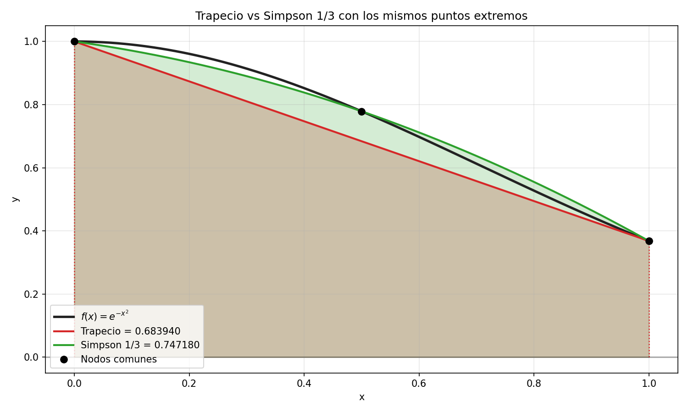
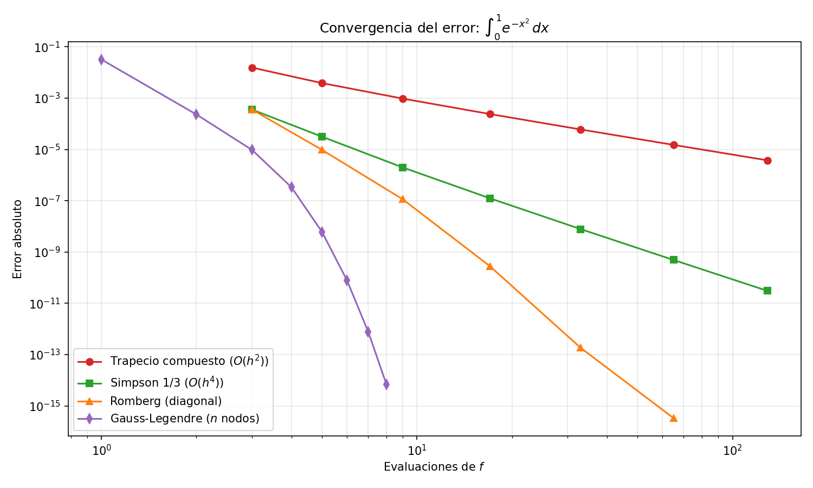
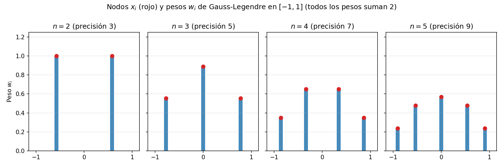

# Integración Numérica 📈

La integración numérica (o **cuadratura numérica**) es el conjunto de técnicas que permiten aproximar el valor de una integral definida cuando no es posible —o no resulta práctico— obtener una antiderivada exacta. Es la herramienta estándar cuando la función no tiene primitiva elemental, cuando solo se conocen valores discretos medidos experimentalmente, o cuando evaluar $f(x)$ es tan costoso que queremos extraerle el máximo partido a cada evaluación.

> **Nota sobre las figuras:** Las imágenes de este documento son gráficas estáticas generadas con Matplotlib a partir de las implementaciones en Python; pueden regenerarse ejecutando [`codigo/generar_graficas.py`](./codigo/generar_graficas.py). Ver el área bajo la curva siendo "cortada" en trapecios y parábolas vale más que mil ecuaciones.

> **Definición:** Una fórmula de cuadratura es toda regla que aproxima la integral definida mediante una suma ponderada de valores de la función en nodos seleccionados:
>
> $$\int_a^b f(x)\,dx \;\approx\; \sum_{i=0}^{n} w_i\, f(x_i)$$
>
> donde los $x_i$ son los **nodos** y los $w_i$ los **pesos**. Cada método se distingue por *cómo elige* los nodos y los pesos.

A lo largo de este documento usaremos un único banco de pruebas para poder comparar todos los métodos entre sí:

$$I = \int_0^1 e^{-x^2}\,dx = \frac{\sqrt{\pi}}{2}\,\mathrm{erf}(1) = 0.7468241328124271\ldots$$

La gaussiana $e^{-x^2}$ es el ejemplo canónico del área porque **no tiene primitiva expresable con funciones elementales**: ni el estudiante más aplicado puede resolverla analíticamente. La única vía práctica es la cuadratura numérica.

## El Problema de la Cuadratura: Concepto General

El Teorema Fundamental del Cálculo garantiza que $\int_a^b f = F(b) - F(a)$ si conocemos una antiderivada $F$. El problema es que esa garantía es engañosa: existen funciones perfectamente continuas cuya antiderivada no se puede escribir en términos de polinomios, exponenciales o trigonométricas. Ejemplos famosos:

- $e^{-x^2}$ (probabilidad y estadística: la campana de Gauss),
- $\frac{\sin x}{x}$ (procesamiento de señales),
- $\sqrt{1+x^4}$ (longitud de arco de curvas).

Además, en ciencia de datos e ingeniería muchas veces $f$ ni siquiera es una fórmula: es un sensor, una simulación, una encuesta. Solo tenemos pares $(x_i, f(x_i))$. En ambos escenarios la estrategia es la misma:

1. Reemplazar la función "difícil" $f$ por una "fácil" $\tilde{f}$ que la aproxime.
2. Integrar $\tilde{f}$ analíticamente (integrar polinomios es trivial).
3. Tomar ese resultado como aproximación de la integral original.

¿Y qué familia de funciones fáciles domina el cálculo numérico? Los polinomios. Y ¿qué técnica construye polinomios a partir de puntos? La [interpolación polinómica](../aproximacion-polinomica/interpolacion-polinomica.md). Ahí está el puente conceptual de todo el curso.

## De la Interpolación a la Integración: Fórmulas de Newton-Cotes

Todas las fórmulas clásicas de cuadratura nacen de una sola idea: **interpolar y luego integrar el interpolante**.

Dados $n+1$ nodos equiespaciados $x_0, x_1, \dots, x_n$ en $[a,b]$ con espaciado $h = \frac{b-a}{n}$, construimos el polinomio de Lagrange $P_n(x)$ que pasa por los $(x_i, f(x_i))$, y lo integramos:

$$\int_a^b P_n(x)\,dx = \int_a^b \sum_{i=0}^{n} f(x_i)\,L_i(x)\,dx = \underbrace{\sum_{i=0}^{n} \left[\int_a^b L_i(x)\,dx\right]}_{w_i}\, f(x_i)$$

Como los $L_i$ dependen solo de los nodos (¡no de $f$!), los pesos $w_i$ pueden calcularse **una vez para cada grado $n$** y sirven para cualquier función. Este esquema, con nodos equiespaciados, recibe el nombre de **fórmulas cerradas de Newton-Cotes** ("cerradas" porque incluyen a los extremos $a$ y $b$ como nodos).

| Grado $n$ | Nodos | Nombre de la fórmula |
|---|---|---|
| 1 | 2 | Regla del Trapecio |
| 2 | 3 | Regla de Simpson 1/3 |
| 3 | 4 | Regla de Simpson 3/8 |
| $\ge 4$ | $n+1$ | Newton-Cotes de orden superior |

Un detalle práctico importante: **subir el grado no siempre ayuda**. Con grados altos ($n \ge 8$) aparecen pesos negativos, lo que amplifica errores de redondeo —es el mismo espíritu del fenómeno de Runge en interpolación—. La solución profesional no es usar grado 10, sino **usar grado bajo muchas veces** (reglas compuestas).

## Regla del Trapecio ($n = 1$)

Es la fórmula más simple posible: reemplazamos $f$ por la recta que une $(a, f(a))$ y $(b, f(b))$, y el "área" pasa a ser la de un trapecio.

$$\int_a^b f(x)\,dx \approx T(a,b) = \frac{b-a}{2}\,\big[f(a) + f(b)\big]$$

**Error local:** si $f \in C^2[a,b]$, existe $\xi \in (a,b)$ tal que

$$E_T = -\frac{(b-a)^3}{12}\, f''(\xi)$$

Dos lecturas de esta fórmula:

- El signo negativo dice que el trapecio **infraestima** cuando la curva es convexa hacia abajo ($f'' < 0$): la cuerda queda por debajo de la curva.
- La dependencia cúbica con $(b-a)$ explica por qué un intervalo grande es peligroso: duplicar el ancho multiplica el error por 8.

> **Ejemplo resuelto:** [Ejemplo 1](./ejemplos/ejemplo-1.md) | **Implementación:** [`trapecio.py`](./codigo/trapecio.py)

## Regla de Simpson 1/3 ($n = 2$)

Ahora interpolamos con una **parábola** por tres puntos equiespaciados $(a, f(a))$, $(m, f(m))$, $(b, f(b))$, con $m = \frac{a+b}{2}$:

$$\int_a^b f(x)\,dx \approx S_{1/3}(a,b) = \frac{b-a}{6}\,\Big[f(a) + 4\,f(m) + f(b)\Big]$$

El nombre "1/3" proviene de la forma equivalente con el paso $h = \frac{b-a}{2}$: $\frac{h}{3}[f_0 + 4f_1 + f_2]$.

**Error local:**

$$E_S = -\frac{(b-a)^5}{180}\, f^{(4)}(\xi)$$

Aquí ocurre el primer milagro de la cuadratura: al derivar la fórmula esperábamos exactitud para parábolas (grado 2), pero el término cúbico del desarrollo de Taylor se cancela **por simetría** alrededor del punto medio, y Simpson resulta exacta también para cúbicas (grado de precisión 3). Pagamos el mismo precio computacional y recibimos un orden extra gratis. La demostración de esta cancelación está en [Demostración del error de cuadratura](./demostraciones/error-cuadratura.md).

> **Ejemplo resuelto:** [Ejemplo 2](./ejemplos/ejemplo-2.md) | **Implementación:** [`simpson-13.py`](./codigo/simpson-13.py)

## Regla de Simpson 3/8 ($n = 3$)

Interpola con un **cubo** por cuatro puntos equiespaciados y su nombre viene del factor $\frac{3h}{8}$:

$$\int_a^b f(x)\,dx \approx S_{3/8}(a,b) = \frac{b-a}{8}\,\Big[f(x_0) + 3\,f(x_1) + 3\,f(x_2) + f(x_3)\Big]$$

**Error local:** $E = -\dfrac{(b-a)^5}{80}\, f^{(4)}(\xi)$ — ocho veces peor que Simpson 1/3 para el mismo ancho, y con idéntico grado de precisión (3). ¿Para qué sirve entonces? Como **pieza de empalme**: si necesitamos una regla compuesta con un número de subintervalos no divisible entre 2 (por ejemplo 5), podemos cubrir 3 subintervalos con 3/8 y los restantes con 1/3.

> **Ejemplo resuelto:** [Ejemplo 3](./ejemplos/ejemplo-3.md) | **Implementación:** [`simpson-38.py`](./codigo/simpson-38.py)

La imagen muestra la misma integral aproximada con una recta (trapecio) y con una parábola (Simpson 1/3) usando **los mismos tres puntos extremos**: la parábola abraza la curvatura de $e^{-x^2}$ mientras la cuerda la recorta visiblemente.

## Reglas Compuestas: Divide y Vencerás

Aplicar una sola vez el trapecio a $[0,1]$ produce un error de $6.3\times 10^{-2}$: inaceptable. La estrategia ganadora consiste en **partir $[a,b]$ en $n$ subintervalos pequeños** y aplicar la regla simple en cada trozo. Al reducir $h$, el error colapsa según el orden del método.

**Trapecio compuesto** con $n$ subintervalos ($h = \frac{b-a}{n}$):

$$T_n = \frac{h}{2}\Big[f(x_0) + 2\sum_{i=1}^{n-1} f(x_i) + f(x_n)\Big], \qquad E = -\frac{(b-a)}{12}\,h^2 f''(\xi)$$

Los nodos interiores pesan doble porque participan en dos trapecios vecinos.

**Simpson 1/3 compuesto** (requiere $n$ **par**):

$$S_n = \frac{h}{3}\Big[f(x_0) + 4\!\!\sum_{i\,\text{impar}}\!\! f(x_i) + 2\!\!\sum_{i\,\text{par}}\!\! f(x_i) + f(x_n)\Big], \qquad E = -\frac{(b-a)}{180}\,h^4 f^{(4)}(\xi)$$

Los pesos alternan 4-2-4-2 porque cada nodo interior impar es punto medio de una parábola (peso 4) y cada par es extremo compartido entre dos parábolas (peso 2).

La consecuencia práctica se lee en la potencia de $h$: **reducir el paso a la mitad reduce el error ×4 en Trapecio pero ×16 en Simpson**, pagando ambos el mismo número de evaluaciones adicionales. La siguiente figura compara la caída del error al refinar la malla:

En escala logarítmica las pendientes delatan el orden: Trapecio desciende con pendiente $-2$ (error $\propto h^2$) y Simpson con pendiente $-4$ (error $\propto h^4$). Gauss-Legendre y Romberg, que refinamos más adelante, ni siquiera necesitan mallas finas para competir.

## Teoría del Error y Grado de Precisión

> **Grado de precisión:** el mayor grado polinomial $m$ tal que la fórmula integra **exactamente** todo polinomio de grado $\le m$. Es la tarjeta de identidad de cualquier cuadratura.

Se puede comprobar a mano calculando $\int_a^b 1\,dx$, $\int_a^b x\,dx$, $\int_a^b x^2\,dx, \dots$ y viendo dónde aparece el primer fallo:

| Fórmula | Grado de precisión | Error local | Orden global |
|---|---|---|---|
| Trapecio | 1 | $-\frac{(b-a)^3}{12}f''(\xi)$ | $O(h^2)$ |
| Simpson 1/3 | 3 | $-\frac{(b-a)^5}{180}f^{(4)}(\xi)$ | $O(h^4)$ |
| Simpson 3/8 | 3 | $-\frac{(b-a)^5}{80}f^{(4)}(\xi)$ | $O(h^4)$ |
| Gauss-Legendre (nodos $n$) | $2n-1$ | $\frac{2^{2n+1}(n!)^4}{(2n+1)[(2n)!]^3} f^{(2n)}(\xi)$ | superexponencial |

Las deducciones completas —cómo el residuo de interpolación se convierte en residuo de cuadratura, y por qué Simpson gana un grado extra— están desarrolladas en [Demostración del Error de Cuadratura](./demostraciones/error-cuadratura.md).

Una advertencia honesta: todas estas cotas contienen derivadas altas de $f$. Si la función tiene esquinas, discontinuidades o oscila violentamente, $f^{(4)}$ puede ser enorme y las promesas teóricas se desinflan. La suavidad de $f$ es parte del contrato.

## Extrapolación de Romberg

Romberg ataca el problema desde otro flanco: en lugar de pedirle más información a $f$, le saca más información a la **estructura del error del trapecio**. El desarrollo asintótico del trapecio compuesto es una serie en potencias pares de $h$:

$$T(h) = I + c_1 h^2 + c_2 h^4 + c_3 h^6 + \cdots$$

Si calculamos $T(h)$ y $T(h/2)$, ambas arrastran el término $c_1h^2$ —pero en proporciones conocidas (4:1)—. Una combinación lineal cancela ese término y deja una aproximación de orden superior:

$$R_{1} = \frac{4\,T(h/2) - T(h)}{4 - 1}$$

Y como el propio $T(h)$ es barato de refinar (recicla todos sus puntos anteriores), el proceso se repite en cascada. La **tabla de Romberg** se construye con dos índices: la columna 0 son trapecios cada vez más finos y cada columna adicional aplica la extrapolación:

$$R_{i,0} = T\!\left(\tfrac{b-a}{2^i}\right), \qquad R_{i,j} = \frac{4^{\,j} R_{i,j-1} - R_{i-1,j-1}}{4^{\,j}-1}$$

| $R_{0,0}$ | | | |
|---|---|---|---|
| $R_{1,0}$ | $R_{1,1}$ | | |
| $R_{2,0}$ | $R_{2,1}$ | $R_{2,2}$ | |
| $R_{3,0}$ | $R_{3,1}$ | $R_{3,2}$ | $R_{3,3}$ |

Cada paso a la derecha gana dos órdenes de exactitud. La diagonal converge hacia el valor exacto a velocidad espectacular: en nuestra integral de prueba, $R_{3,3}$ alcanza $10^{-7}$ de error con apenas 9 evaluaciones de $f$. El detalle paso a paso está en el [Ejemplo 4](./ejemplos/ejemplo-4.md) y su implementación en [`romberg.py`](./codigo/romberg.py).

## Cuadratura de Gauss-Legendre: Nodos Óptimos

Newton-Cotes tiene un vicio oculto: **elige los nodos por conveniencia (equiespaciamiento), no por rendimiento**. Gauss hizo la pregunta correcta: *si soy libre de elegir nodos Y pesos (2n parámetros libres), ¿qué tan bien puedo ajustar?* La respuesta: exactitud para polinomios de grado $2n-1$ con solo $n$ evaluaciones —el doble de precisión que cualquier fórmula con nodos fijos—.

La respuesta matemática elegante llega de la mano de los **polinomios de Legendre** $P_n(x)$, ortogonales en $[-1,1]$:

$$(n+1)P_{n+1}(x) = (2n+1)\,x\,P_n(x) - n\,P_{n-1}(x), \qquad P_0 = 1,\quad P_1 = x$$

> **Teorema (Cuadratura Gaussiana):** Los nodos óptimos son las **raíces del polinomio de Legendre $P_n$**, y los pesos valen
>
> $$w_i = \frac{2}{\left(1 - x_i^2\right)\left[P_n'(x_i)\right]^2}$$
>
> Con ellos, $\displaystyle\int_{-1}^{1} p(x)\,dx = \sum_{i=1}^{n} w_i\, p(x_i)$ es exacta para todo polinomio de grado $\le 2n-1$.

Como $P_n$ vive naturalmente en $[-1,1]$, cualquier intervalo real $[a,b]$ requiere el cambio de variable:

$$x = \frac{a+b}{2} + \frac{b-a}{2}\,t, \qquad \int_a^b f(x)\,dx = \frac{b-a}{2}\int_{-1}^{1} f\!\left(\frac{a+b}{2} + \frac{b-a}{2}t\right)dt$$

Tabla de nodos y pesos (todos los pesos suman 2, reflejo de que $\int_{-1}^1 1\,dx = 2$):

| $n$ | Nodos $x_i$ | Pesos $w_i$ | Grado de precisión |
|---|---|---|---|
| 1 | $0$ | $2$ | 1 |
| 2 | $\pm 1/\sqrt{3} \approx \pm 0.577350$ | $1, 1$ | 3 |
| 3 | $0;\ \pm\sqrt{3/5} \approx \pm 0.774597$ | $\tfrac{8}{9};\ \tfrac{5}{9},\ \tfrac{5}{9}$ | 5 |
| 4 | $\pm 0.339981,\ \pm 0.861136$ | $0.652145,\ 0.347855$ | 7 |

Fíjate en la asimetría inteligente de los pesos de $n=3$: el centro pesa casi el doble que los flancos, imitando dónde acumula masa una función suave. La distribución de nodos y pesos se aprecia aquí:

La comparación decisiva contra Newton-Cotes, sobre nuestra integral de prueba:

| Método | Evaluaciones de $f$ | Resultado | Error absoluto |
|---|---|---|---|
| Trapecio compuesto ($n{=}4$) | 5 | 0.7429840978 | $3.84\times 10^{-3}$ |
| Simpson 1/3 compuesto ($n{=}4$) | 5 | 0.7468553798 | $3.12\times 10^{-5}$ |
| Simpson 3/8 simple ($n{=}3$) | 4 | 0.7469923196 | $1.68\times 10^{-4}$ |
| Romberg ($R_{3,3}$) | 9 | 0.7468240185 | $1.14\times 10^{-7}$ |
| Gauss-Legendre ($n{=}3$) | 3 | 0.7468145842 | $9.55\times 10^{-6}$ |

Con **tres evaluaciones**, Gauss hace algo que al trapecio le tomaría miles: gana cinco órdenes de magnitud. Cuando cada evaluación de $f$ implica ejecutar una simulación costosa, esta diferencia define qué problemas son resolubles.

> **Ejemplo resuelto:** [Ejemplo 5](./ejemplos/ejemplo-5.md) | **Implementación:** [`gauss-legendre.py`](./codigo/gauss-legendre.py)

## Principales métodos de integración numérica

1. **Regla del Trapecio**: [Ejemplo 1](./ejemplos/ejemplo-1.md) | [Código Python](./codigo/trapecio.py)
2. **Simpson 1/3**: [Ejemplo 2](./ejemplos/ejemplo-2.md) | [Código Python](./codigo/simpson-13.py)
3. **Simpson 3/8**: [Ejemplo 3](./ejemplos/ejemplo-3.md) | [Código Python](./codigo/simpson-38.py)
4. **Romberg**: [Ejemplo 4](./ejemplos/ejemplo-4.md) | [Código Python](./codigo/romberg.py)
5. **Gauss-Legendre**: [Ejemplo 5](./ejemplos/ejemplo-5.md) | [Código Python](./codigo/gauss-legendre.py)

## Análisis de Complejidad Algorítmica

Todos los métodos presentados cuestan $O(n)$ evaluaciones para $n$ subintervalos —nadie gana por "velocidad bruta", sino por **cuánto error cometen con las mismas evaluaciones**. La métrica relevante es el número de evaluaciones de $f$ necesarias para alcanzar una tolerancia dada.

### Costos y órdenes

| Método | Evaluaciones para $n$ subintervalos | Orden de convergencia | Recicla puntos previos |
|---|---|---|---|
| Trapecio compuesto | $n+1$ | $O(h^2)$ | No |
| Simpson 1/3 compuesto | $n+1$ ($n$ par) | $O(h^4)$ | No |
| Simpson 3/8 compuesto | $n+1$ ($n$ múltiplo de 3) | $O(h^4)$ | No |
| Romberg | $2^k+1$ para tabla $k\times k$ | $O(h^{2j})$ en columna $j$ | **Sí** (columna 0) |
| Gauss-Legendre | $n$ | Exactitud $O(h^{2n})$ por bloque | No aplica |

### Detalle: el costo oculto de cada familia

- **Newton-Cotes compuestos**: baratos por evaluación, pero cada refinamiento desde cero descarta el trabajo anterior. Si ya calculé $T_8$ y quiero $T_{16}$, solo los puntos impares son nuevos —detectarlo y aprovecharlo es precisamente lo que hace Romberg.
- **Romberg**: el costo total sigue siendo dominado por las evaluaciones de la primera columna; la extrapolación es aritmética gratuita ($O(k^2)$ operaciones elementales).
- **Gauss**: requiere nodos/pesos precalculados (raíces de Legendre). Obtenerlos numéricamente cuesta un cálculo inicial de valores propios o búsqueda de raíces, amortizado después para siempre. Bibliotecas como SciPy los traen listos (`numpy.polynomial.legendre.leggauss`).

## Conclusiones: Criterios de Selección en el Cálculo Numérico

### 1. Suavidad de la función manda

Las cotas de error contienen $f''$, $f^{(4)}$ o $f^{(2n)}$. Para funciones suaves, Simpson y Gauss brillan; para funciones con picos o discontinuidades, el humilde trapecio compuesto es sorprendentemente robusto porque nunca presume de curvatura que no existe.

### 2. ¿Qué escasea: puntos o paciencia?

- Función barata de evaluar (una fórmula): Simpson compuesto con $n$ moderado es el caballo de batalla.
- Función cara (simulación, experimento físico): Gauss-Legendre, sin discusión.
- Datos discretos que llegan secuencialmente (sensores): Trapecio/Simpson compuestos, que trabajan con lo que tienen.

### 3. ¿Necesitas control del error?

Romberg ofrece algo único: la diferencia entre diagonales consecutivas de la tabla es un estimador de error gratuito, ideal para detenerse automáticamente al alcanzar la tolerancia pedida.

### Tabla de Criterio de Selección

| Situación | Método recomendado |
|---|---|
| Función suave, evaluación barata | Simpson 1/3 compuesto |
| Evaluación muy costosa, alta precisión | Gauss-Legendre |
| Alta precisión con control automático de error | Romberg |
| Datos ruidosos o a trozos | Trapecio compuesto |
| Subintervalos no compatibles ($n$ impar mixto) | Empalme Simpson 1/3 + 3/8 |

## Aplicaciones Prácticas de la Integración Numérica

- **Estadística y probabilidad:** valores de la distribución normal $\Phi(z) = \frac{1}{\sqrt{2\pi}}\int_{-\infty}^{z} e^{-t^2/2}\,dt$ — la razón por la que elegimos nuestra función de prueba.
- **Ingeniería estructural:** momentos de inercia y centroides de perfiles irregulares a partir de mediciones discretas.
- **Energía eléctrica:** facturación consume $\int P(t)\,dt$ donde $P(t)$ llega como lecturas horizontales de medidor (trapecio compuesto literal).
- **Farmacocinética:** el área bajo la curva concentración-tiempo (AUC) determina dosis y bioequivalencia de fármacos, a partir de pocas muestras sanguíneas —un problema genuino de pocos datos donde la elección de la cuadratura importa clínicamente.
